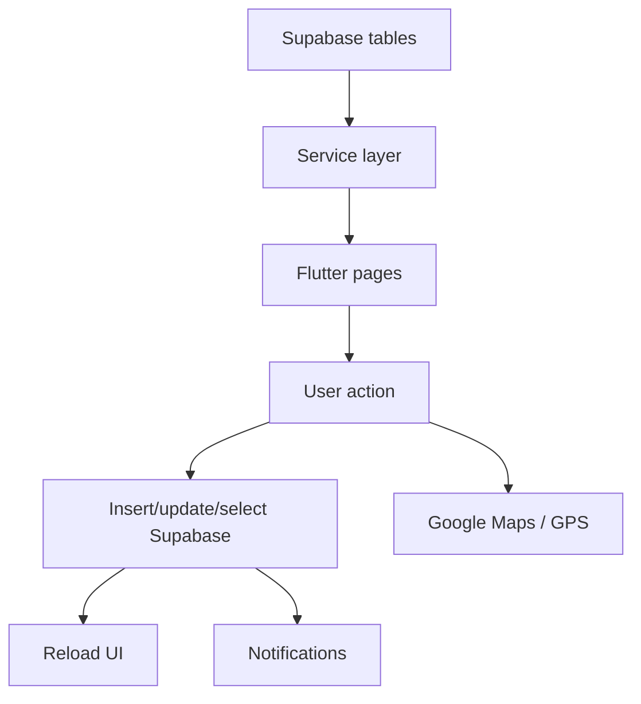
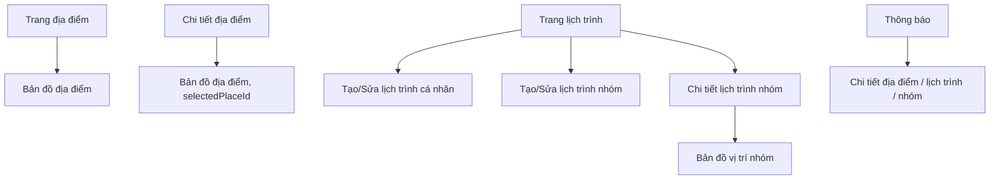
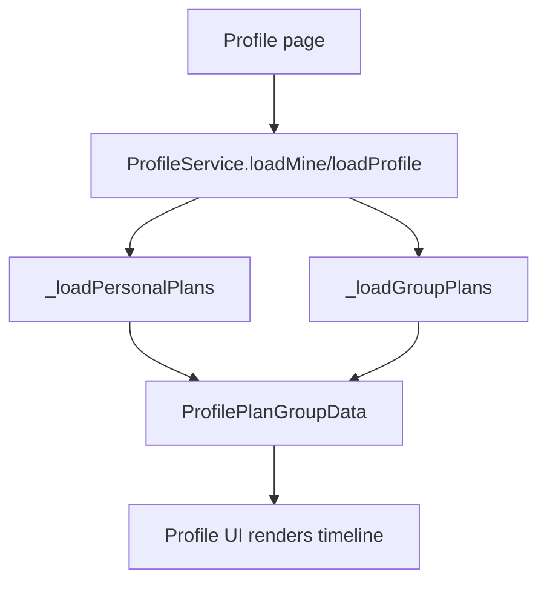

# Tri thức luồng Map và Lịch trình GoMate

Tài liệu này dùng để trình bày phần Map, Địa điểm, Lịch trình cá nhân và Lịch trình nhóm trong project GoMate.

Mục tiêu của tài liệu:

- Nắm luồng chạy từ Supabase -> service -> UI -> route -> thông báo.
- Hiểu vì sao mỗi bảng dữ liệu tồn tại.
- Biết các dòng code quan trọng nhất của chức năng, dòng đó lấy gì, lấy xong đi đâu.
- Không giải thích chi tiết từng widget nhỏ.

Các file chính:

- `lib/features/places/presentation/pages/trang_ban_do_dia_diem_page.dart`
- `lib/features/places/data/services/dia_diem_service.dart`
- `lib/features/itinerary/data/services/lich_trinh_service.dart`
- `lib/features/itinerary/data/services/lich_trinh_nhom_service.dart`
- `lib/features/itinerary/presentation/pages/trang_them_sua_lich_trinh.dart`
- `lib/features/itinerary/presentation/pages/trang_them_sua_lich_trinh_nhom.dart`
- `lib/features/itinerary/presentation/pages/trang_chi_tiet_lich_trinh_nhom.dart`
- `lib/features/itinerary/presentation/pages/trang_ban_do_vi_tri_nhom.dart`
- `lib/core/services/profile_service.dart`
- `lib/features/notifications/presentation/pages/trang_thongbao.dart`
- `lib/features/notifications/data/notification_service.dart`

Các SQL patch liên quan:

- `supabase_places_map_share_rls_patch.sql`
- `supabase_notification_reference_links_patch.sql`
- `supabase_group_trips_member_stops_rls_patch.sql`
- `supabase_group_trip_pinning_reminders_patch.sql`
- `supabase_group_trip_member_notifications_patch.sql`

## 1. Bức tranh tổng thể

Project có 2 khối lớn liên quan trực tiếp đến phần bạn trình bày:

1. Map địa điểm:
   - Hiển thị địa điểm chung của hệ thống.
   - Hiển thị địa điểm riêng của từng user.
   - Cho user tự ghim vị trí, lưu địa điểm, sửa, xóa, chia sẻ địa điểm.
   - Mở Google Maps để chỉ đường.

2. Lịch trình:
   - Lịch trình cá nhân: user tự tạo plan theo từng ngày, từng giờ, dùng các địa điểm trong bảng `places`.
   - Lịch trình nhóm: nhiều user cùng xem điểm dừng, cập nhật vị trí, kiểm tra ai đã tới, nhận thông báo.
   - Cả hai đều có cơ chế ghim để hệ thống nhắc giờ.

Luồng lớn:



## 2. Các bảng dữ liệu chính

### 2.1. `places`

Đây là bảng trung tâm cho Map và Lịch trình.

Cột quan trọng:

- `id`: id địa điểm.
- `name`: tên địa điểm.
- `province`, `district`, `address`: địa chỉ hiển thị và tìm kiếm.
- `latitude`, `longitude`: tọa độ để vẽ marker và mở Google Maps.
- `user_id`: quyết định địa điểm là chung hay riêng.
- `copied_from_place_id`: nếu địa điểm được share từ người khác, dòng copy sẽ trỏ về địa điểm gốc.
- `keywords`: chứa từ khóa, đồng thời đang dùng để suy ra biểu tượng marker.
- `cover_image`: ảnh đại diện địa điểm.
- `status`: `active` thì hiện, `deleted` thì ẩn.

Nghiệp vụ:

- `user_id = null`: địa điểm chung, mọi user đều thấy.
- `user_id = currentUser.id`: địa điểm riêng, chỉ user đó thấy.
- Khi share địa điểm, app tạo một dòng mới trong `places` cho người nhận.

### 2.2. `itineraries`

Bảng lịch trình cá nhân.

Cột quan trọng:

- `profile_id`: chủ lịch trình.
- `name`, `description`: tên và mô tả.
- `planned_start_date`, `planned_end_date`: khoảng ngày của lịch trình.
- `pinned`: lịch trình đang ghim hay không.
- `actual_start_time`: thời điểm bắt đầu thật khi ghim.
- `status`: `draft`, `active`, `deleted`.

### 2.3. `itinerary_items`

Các điểm đến trong lịch trình cá nhân.

Cột quan trọng:

- `itinerary_id`: thuộc lịch trình nào.
- `place_id`: đi tới địa điểm nào trong `places`.
- `planned_time`: thời gian dự kiến đến điểm đó.
- `order_no`: thứ tự điểm đến.
- `gps_confirmed`: GPS đã xác nhận user đến chưa.
- `gps_distance`: khoảng cách GPS khi xác nhận.

### 2.4. `itinerary_reminders`

Nhắc giờ cho lịch trình cá nhân.

Cột quan trọng:

- `itinerary_item_id`: nhắc cho điểm đến nào.
- `remind_time`: thời điểm cần nhắc.
- `status`: `pending` hoặc `sent`.

Luồng: khi tạo/sửa lịch trình, service tạo reminder trước 45 phút. Khi app mở và lịch trình đang ghim, service kiểm tra reminder đến hạn, insert notification.

### 2.5. `trip_groups`

Bảng lịch trình nhóm.

Cột quan trọng:

- `owner_id`: nhóm trưởng, người tạo lịch trình.
- `title`, `description`: tên và mô tả.
- `start_date`, `end_date`: khoảng ngày.
- `status`: trạng thái.

### 2.6. `trip_members`

Thành viên trong lịch trình nhóm.

Cột quan trọng:

- `trip_id`: thuộc nhóm nào.
- `user_id`: thành viên nào.
- `role`: `owner` hoặc `member`.
- `status`: `active`, bị xóa thì không còn trong nhóm.
- `pinned`: mỗi thành viên có thể ghim lịch trình nhóm riêng.
- `actual_start_time`: thời điểm thành viên bắt đầu thật.

Điểm quan trọng: ghim lịch trình nhóm không nằm ở `trip_groups`, mà nằm ở `trip_members`, vì mỗi user trong nhóm có quyền ghim hoặc không ghim riêng.

### 2.7. `trip_stops`

Các điểm dừng trong lịch trình nhóm.

Cột quan trọng:

- `trip_id`: thuộc lịch trình nhóm nào.
- `place_id`: link về bảng `places`.
- `title`, `address`, `latitude`, `longitude`: snapshot của địa điểm để hiển thị nhanh.
- `arrive_at`: giờ cần có mặt.
- `check_radius_m`: bán kính kiểm tra, hiện dùng 300m.
- `sort_order`: thứ tự điểm dừng.

### 2.8. `user_location_snapshots`

Vị trí mới nhất của từng user trong nhóm.

Cột quan trọng:

- `user_id`
- `latitude`, `longitude`
- `accuracy_m`
- `updated_at`

Luồng: khi mở map nhóm hoặc check điểm dừng, app cập nhật GPS hiện tại của mình vào bảng này. Sau đó các thành viên khác lấy dữ liệu này để xem vị trí.

### 2.9. `trip_stop_checkins`

Kết quả kiểm tra ai đã tới điểm dừng.

Cột quan trọng:

- `trip_stop_id`
- `trip_id`
- `user_id`
- `distance_m`
- `is_arrived`
- `checked_at`
- `status`: `arrived`, `not_arrived`, `no_location`, `stale_location`.

### 2.10. `notifications`

Bảng thông báo chung.

Cột quan trọng:

- `profile_id`: người nhận thông báo.
- `notification_type`: loại thông báo.
- `title`: thường là tên người gây ra thông báo hoặc title thông báo.
- `content`: nội dung hiển thị.
- `reference_id`: id để điều hướng khi bấm thông báo.
- `is_read`: đã đọc chưa.

Các type liên quan:

- `place_share`: có người share địa điểm.
- `itinerary_reminder`: nhắc lịch trình cá nhân.
- `group_itinerary_reminder`: nhắc lịch trình nhóm.
- `group_trip_member_added`: có người thêm mình vào lịch trình nhóm.

## 3. Route và màn hình

Các route chính:

- `AppRoutes.placeList`: danh sách địa điểm.
- `AppRoutes.placeDetail`: chi tiết địa điểm.
- `AppRoutes.placeMap`: bản đồ địa điểm.
- `AppRoutes.tripList`: danh sách lịch trình cá nhân + nhóm.
- `AppRoutes.tripCreate`: tạo/sửa lịch trình cá nhân.
- `AppRoutes.tripDetail`: chi tiết lịch trình cá nhân.
- `AppRoutes.groupTripCreate`: tạo/sửa lịch trình nhóm.
- `AppRoutes.groupTripDetail`: chi tiết lịch trình nhóm.
- `AppRoutes.groupTripMap`: bản đồ vị trí nhóm.
- `AppRoutes.notifications`: thông báo.

Luồng route quan trọng:



## 4. Luồng Map địa điểm

File chính: `lib/features/places/presentation/pages/trang_ban_do_dia_diem_page.dart`

### 4.1. Khi mở map, app lấy địa điểm nào?

Dòng quan trọng:

```dart
final userId = _currentUserId;

final response = userId == null
    ? await _supabase
          .from('places')
          .select(_placeSelectColumns)
          .eq('status', 'active')
          .filter('user_id', 'is', null)
    : await _supabase
          .from('places')
          .select(_placeSelectColumns)
          .eq('status', 'active')
          .or('user_id.is.null,user_id.eq.$userId');
```

Dòng này làm gì:

- Nếu chưa đăng nhập, chỉ lấy địa điểm chung `user_id is null`.
- Nếu đã đăng nhập, lấy cả:
  - địa điểm chung: `user_id is null`
  - địa điểm riêng của mình: `user_id = currentUser.id`

Dữ liệu lấy xong đi đâu:

```dart
final data = (response as List)
    .map((json) => _MapPlace.fromJson(Map<String, dynamic>.from(json)))
    .where((item) => item.hasLatLng)
    .toList();
```

- Chuyển từng dòng Supabase thành `_MapPlace`.
- Chỉ giữ địa điểm có `latitude` và `longitude`.
- Sau đó gán vào `_tatCaDiaDiem`.
- UI dùng `_tatCaDiaDiem` để vẽ marker trên `FlutterMap`.

### 4.2. Vì sao địa điểm thiếu tọa độ không hiện marker?

Dòng quan trọng:

```dart
bool get hasLatLng => latitude != null && longitude != null;
```

Nếu thiếu lat/lng thì không thể vẽ marker và không thể mở chỉ đường chính xác.

### 4.3. Tìm kiếm trên map

Dòng quan trọng:

```dart
final text = _normalize(
  '${item.name} ${item.province} ${item.district ?? ''} '
  '${item.address ?? ''} ${item.keywords ?? ''} ${item.description ?? ''}',
);

return text.contains(keyword);
```

Luồng:

- User gõ vào ô tìm kiếm.
- App gom tên, tỉnh, quận, địa chỉ, từ khóa, mô tả thành một chuỗi.
- Chuẩn hóa chuỗi rồi so khớp keyword.
- Kết quả lọc được dùng để vẽ lại marker và danh sách địa điểm.

### 4.4. Vì sao địa điểm riêng được ưu tiên hiện trước?

Dòng quan trọng:

```dart
final mineA = a.isMine(_currentUserId) ? 1 : 0;
final mineB = b.isMine(_currentUserId) ? 1 : 0;
final ownerCompare = mineB.compareTo(mineA);
if (ownerCompare != 0) return ownerCompare;
```

Ý nghĩa:

- Địa điểm của mình được đưa lên trước địa điểm chung.
- Nếu cùng loại, mới sắp tiếp theo rating và số lưu.

### 4.5. Khi từ chi tiết địa điểm bấm xem bản đồ

Ở chi tiết địa điểm:

```dart
Navigator.pushNamed(
  context,
  AppRoutes.placeMap,
  arguments: {'selectedPlaceId': diaDiem.maDiaDiem},
);
```

Sang map:

```dart
final args = ModalRoute.of(context)?.settings.arguments;
if (args is Map<String, dynamic>) {
  _selectedPlaceIdFromDetail = args['selectedPlaceId'] as int?;
}
```

Luồng:

- Trang chi tiết gửi `selectedPlaceId`.
- Trang map nhận id này.
- Sau khi load danh sách địa điểm, map tìm đúng địa điểm có id đó.
- Map di chuyển camera tới marker và mở card địa điểm.

### 4.6. Thêm địa điểm riêng trên map

Luồng người dùng:

1. Mở map.
2. Bấm nút thêm.
3. App vào chế độ ghim vị trí.
4. User kéo/đặt ghim hoặc dùng GPS hiện tại.
5. Bấm tiếp tục.
6. App mở form nhập thông tin địa điểm.
7. Bấm lưu.
8. App insert vào `places` với `user_id = currentUser.id`.
9. Reload map.

Dòng bắt đầu thêm:

```dart
if (userId == null) {
  _showMessage('Bạn cần đăng nhập để thêm địa điểm riêng');
  return;
}

_dangGhimViTri = true;
_viTriDangGhim = startPoint;
```

Ý nghĩa:

- Chỉ user đăng nhập mới có bản đồ riêng.
- `_dangGhimViTri = true` làm UI chuyển sang chế độ đặt ghim.
- `_viTriDangGhim` là tọa độ đang chuẩn bị lưu.

Dòng lấy GPS hiện tại để ghim:

```dart
final position = await _layViTriHienTai();
final point = LatLng(position.latitude, position.longitude);
_viTriDangGhim = point;
_mapController.move(point, 16);
```

Ý nghĩa:

- App xin GPS hiện tại.
- Biến GPS thành `LatLng`.
- Đưa ghim tới vị trí hiện tại.
- Zoom map tới chỗ đó.

Dòng tạo data để insert:

```dart
final data = <String, dynamic>{
  'name': name,
  'province': province,
  'district': districtController.text.trim().isEmpty ? null : districtController.text.trim(),
  'address': addressController.text.trim().isEmpty ? null : addressController.text.trim(),
  'description': descriptionController.text.trim().isEmpty ? null : descriptionController.text.trim(),
  'keywords': mergedKeywords.isEmpty ? null : mergedKeywords,
  'price': price,
  'cover_image': coverImage,
  'latitude': selectedLocation.latitude,
  'longitude': selectedLocation.longitude,
  'status': 'active',
  'user_id': userId,
  'updated_at': DateTime.now().toIso8601String(),
};
```

Ý nghĩa:

- `latitude` và `longitude` lấy từ ghim trên map, không nhập tay.
- `user_id = userId` biến địa điểm này thành địa điểm riêng.
- `keywords` có cả từ khóa người nhập và keyword của icon marker.
- `cover_image` là ảnh sau khi upload lên Supabase Storage.

Dòng insert:

```dart
await _supabase.from('places').insert(data);
```

Sau khi insert xong, app đóng form, báo thành công và gọi lại `_taiDiaDiemLenBanDo()` để marker mới xuất hiện.

### 4.7. Sửa địa điểm riêng

Dòng kiểm tra quyền:

```dart
if (!place.isMine(_currentUserId)) {
  _showMessage('Bạn chỉ được sửa địa điểm của mình');
  return;
}
```

Dòng update:

```dart
final updated = await _supabase
    .from('places')
    .update(data)
    .eq('id', place.id)
    .eq('user_id', userId)
    .select(_placeSelectColumns)
    .maybeSingle();
```

Ý nghĩa:

- Dù UI đã chặn, query vẫn thêm `.eq('user_id', userId)`.
- Nếu địa điểm chung hoặc địa điểm của người khác, Supabase không update được.
- Đây là lớp bảo vệ quan trọng để tránh sửa nhầm dữ liệu chung.

### 4.8. Xóa địa điểm riêng

Project không xóa vật lý ngay, mà update `status = deleted`.

Dòng quan trọng:

```dart
final deleted = await _supabase
    .from('places')
    .update({
      'status': 'deleted',
      'updated_at': DateTime.now().toIso8601String(),
    })
    .eq('id', place.id)
    .eq('user_id', _currentUserId!)
    .select('id')
    .maybeSingle();
```

Ý nghĩa:

- Chỉ địa điểm riêng của user mới xóa được.
- Địa điểm chung `user_id = null` không pass điều kiện `.eq('user_id', currentUser)`.
- Map chỉ load `status = active`, nên địa điểm bị xóa sẽ biến mất khỏi map.

### 4.9. Chia sẻ địa điểm

Điều kiện:

- Phải đăng nhập.
- Chỉ share địa điểm của mình.
- Chỉ share cho bạn bè follow hai chiều.

Dòng kiểm tra địa điểm của mình:

```dart
if (!place.isMine(userId)) {
  _showMessage('Chỉ được share địa điểm của bạn');
  return;
}
```

Dòng lấy bạn bè hai chiều:

```dart
final friendIds = following.intersection(followers).toList();
```

Ý nghĩa:

- `following`: mình đang follow ai.
- `followers`: ai đang follow mình.
- Giao nhau của hai tập là bạn bè thật.

Dòng share:

```dart
final result = await _supabase.rpc('share_place_direct', params: {
  'p_place_id': place.id,
  'p_to_user_id': friend.id,
});
```

Ý nghĩa:

- App không tự insert copy bằng Flutter.
- App gọi RPC Supabase `share_place_direct`.
- RPC copy địa điểm sang `places` của người nhận.
- Dòng copy có `user_id = người nhận` và `copied_from_place_id = địa điểm gốc`.
- RPC cũng tạo notification `place_share`.

### 4.10. Mở Google Maps chỉ đường

Dòng quan trọng:

```dart
final navigationUri = Uri.parse(
  'google.navigation:q=$destinationLat,$destinationLng&mode=d',
);
```

Ý nghĩa:

- Ưu tiên mở Google Maps app ở chế độ điều hướng.

Fallback:

```dart
final directionsUri = Uri.https('www.google.com', '/maps/dir/', {
  'api': '1',
  'origin': '${position.latitude},${position.longitude}',
  'destination': '$destinationLat,$destinationLng',
  'travelmode': 'driving',
  'dir_action': 'navigate',
});
```

Ý nghĩa:

- Nếu app Google Maps không mở được, mở URL Google Maps web.
- `origin` là GPS hiện tại.
- `destination` là tọa độ địa điểm.

## 5. Luồng Lịch trình cá nhân

File chính:

- `lib/features/itinerary/presentation/pages/trang_them_sua_lich_trinh.dart`
- `lib/features/itinerary/data/services/lich_trinh_service.dart`

### 5.1. Tư duy thiết kế lịch trình cá nhân

Người dùng chọn:

- Ngày bắt đầu.
- Ngày kết thúc.

Sau đó UI tự sinh:

- Ngày 1
- Ngày 2
- Ngày 3
- ...

Khi thêm địa điểm, user chỉ chọn giờ. Ngày sẽ lấy từ ngày đang chọn.

Mục đích:

- Tránh user chọn giờ/ngày bị tràn ra ngoài khoảng lịch trình.
- Tránh lỗi như chọn lịch từ ngày 6 đến ngày 8 nhưng điểm đến lại rơi vào ngày 9.
- Làm UI dễ hiểu hơn khi trình bày: mỗi ngày là một timeline riêng.

### 5.2. Tính số ngày trong lịch trình

Dòng quan trọng:

```dart
final count = end.difference(start).inDays + 1;
```

Ý nghĩa:

- Nếu bắt đầu ngày 6, kết thúc ngày 8:
  - `8 - 6 = 2`
  - cộng 1 thành 3 ngày
  - UI hiện Ngày 1, Ngày 2, Ngày 3.

### 5.3. Ngày đang chọn

Dòng quan trọng:

```dart
return DateTime(
  _ngayBatDau!.year,
  _ngayBatDau!.month,
  _ngayBatDau!.day,
).add(Duration(days: _ngayDangChonIndex));
```

Ý nghĩa:

- `_ngayDangChonIndex = 0` là ngày bắt đầu.
- `_ngayDangChonIndex = 1` là ngày bắt đầu + 1.
- Không cần user chọn ngày trong date picker lần nữa.

### 5.4. Khi thêm địa điểm, chỉ chọn giờ

Dòng quan trọng:

```dart
final selectedDate = _ngayDangChon;
```

Sau đó:

```dart
return DateTime(
  selectedDate.year,
  selectedDate.month,
  selectedDate.day,
  pickedTime.hour,
  pickedTime.minute,
);
```

Ý nghĩa:

- Date lấy từ tab ngày đang chọn.
- Time lấy từ dialog chọn giờ.
- Kết quả là `plannedTime`.
- `plannedTime` được đưa vào `_items`.

### 5.5. Chỉ hiển thị điểm của ngày đang chọn

Dòng quan trọng:

```dart
final result = _items.where((item) {
  return _cungNgay(item.plannedTime, selectedDate);
}).toList();
```

Ý nghĩa:

- Toàn bộ lịch trình có thể có nhiều điểm nhiều ngày.
- Nhưng UI timeline chỉ hiện điểm thuộc ngày đang mở.
- Khi đổi Ngày 1 sang Ngày 2, danh sách thay đổi theo.

### 5.6. Khi lưu lịch trình cá nhân

Trang UI gom các item thành draft:

```dart
LichTrinhDraftItem(
  placeId: item.place.id,
  plannedTime: item.plannedTime,
  note: item.note,
)
```

Sau đó gọi service:

```dart
await _service.taoLichTrinh(...)
```

hoặc:

```dart
await _service.capNhatLichTrinh(...)
```

Service insert lịch trình:

```dart
final planRow = await _client
    .from('itineraries')
    .insert({
      'profile_id': user.id,
      'name': name.trim(),
      'planned_start_date': _dateOnly(startDate),
      'planned_end_date': _dateOnly(endDate),
      'status': pinned ? 'active' : 'draft',
      'pinned': pinned,
    })
    .select('id')
    .single();
```

Ý nghĩa:

- Insert dòng cha vào `itineraries`.
- Lấy lại `id`.
- `id` này dùng để insert các điểm vào `itinerary_items`.

Sau đó:

```dart
await _themItemsVaNhacNho(itineraryId: itineraryId, items: items);
```

Ý nghĩa:

- Insert các điểm đến.
- Tạo reminder trước 45 phút cho từng điểm.

### 5.7. Insert các điểm trong lịch trình cá nhân

Dòng quan trọng:

```dart
final sortedItems = List<LichTrinhDraftItem>.from(items)
  ..sort((a, b) => a.plannedTime.compareTo(b.plannedTime));
```

Ý nghĩa:

- Dù user thêm điểm theo thứ tự nào, khi lưu vẫn sắp xếp theo thời gian.

Dòng insert item:

```dart
itemRows.add({
  'itinerary_id': itineraryId,
  'place_id': item.placeId,
  'order_no': i + 1,
  'planned_time': item.plannedTime.toIso8601String(),
  'note': item.note.trim(),
  'status': 'planned',
  'gps_confirmed': false,
});
```

Ý nghĩa:

- Mỗi địa điểm trong lịch trình trở thành một dòng `itinerary_items`.
- `planned_time` là thời gian user chọn.
- `gps_confirmed = false` vì lúc mới tạo chưa xác nhận đã tới.

### 5.8. Reminder cá nhân

Dòng quan trọng:

```dart
'remind_time': plannedTime
    .subtract(const Duration(minutes: 45))
    .toIso8601String(),
```

Ý nghĩa:

- App nhắc trước giờ đi 45 phút.
- Reminder được insert vào `itinerary_reminders`.

Khi app kiểm tra reminder đến giờ:

```dart
await _client.from('notifications').insert({
  'profile_id': userId,
  'notification_type': 'itinerary_reminder',
  'reference_id': itineraryId,
  'place_id': itemMap['place_id'],
  'is_read': false,
});
```

Ý nghĩa:

- Tạo thông báo cho user.
- `reference_id = itineraryId` để bấm notification mở đúng lịch trình.
- `place_id` giữ lại địa điểm liên quan.

### 5.9. GPS xác nhận user đã đến điểm trong lịch trình cá nhân

Dòng quan trọng:

```dart
final distance = Geolocator.distanceBetween(
  position.latitude,
  position.longitude,
  item.place!.viDo,
  item.place!.kinhDo,
);
```

Ý nghĩa:

- Lấy GPS hiện tại của user.
- So với tọa độ địa điểm trong `places`.

Dòng quyết định:

```dart
if (distance <= 250) {
  await danhDauDaDenBangGps(itemId: item.id, distance: distance);
}
```

Ý nghĩa:

- Nếu user trong bán kính 250m, app tự đánh dấu đã đến.

## 6. Luồng Lịch trình nhóm

File chính:

- `lib/features/itinerary/presentation/pages/trang_them_sua_lich_trinh_nhom.dart`
- `lib/features/itinerary/presentation/pages/trang_chi_tiet_lich_trinh_nhom.dart`
- `lib/features/itinerary/presentation/pages/trang_ban_do_vi_tri_nhom.dart`
- `lib/features/itinerary/data/services/lich_trinh_nhom_service.dart`

### 6.1. Lịch trình nhóm giống cá nhân ở phần soạn ngày

Lịch trình nhóm hiện đã theo logic giống lịch trình cá nhân:

- Chọn ngày bắt đầu.
- Chọn ngày kết thúc.
- UI hiện Ngày 1, Ngày 2, Ngày 3.
- Khi thêm địa điểm chỉ chọn giờ.
- App gắn giờ đó vào ngày đang chọn.

Dòng ngày đang chọn:

```dart
return DateTime(
  start.year,
  start.month,
  start.day,
).add(Duration(days: _selectedDayIndex));
```

Dòng thêm địa điểm vào đúng ngày:

```dart
return DateTime(
  selectedDate.year,
  selectedDate.month,
  selectedDate.day,
  pickedTime.hour,
  pickedTime.minute,
);
```

Ý nghĩa:

- Không còn date picker riêng cho từng stop.
- Tránh điểm dừng bị lọt ra ngoài khoảng ngày của lịch trình nhóm.

Lớp bảo vệ trước khi lưu:

```dart
_clampStopsToDateRange();
_sortStops();
```

Ý nghĩa:

- Nếu ngày bắt đầu/kết thúc bị sửa hẹp lại, điểm dừng ngoài khoảng sẽ được kéo về ngày gần nhất trong khoảng.
- Sau đó sort lại theo giờ.

### 6.2. Chọn bạn bè vào lịch trình nhóm

Service lấy bạn bè follow hai chiều:

```dart
final friendIds = following.intersection(followers).toList();
```

Ý nghĩa:

- Chỉ người theo dõi qua lại mới được thêm vào nhóm.
- Tránh thêm người lạ vào lịch trình nhóm.

### 6.3. Tạo lịch trình nhóm

Service tạo group:

```dart
final groupRow = await _client
    .from('trip_groups')
    .insert({
      'owner_id': user.id,
      'title': title.trim(),
      'description': description.trim(),
      'start_date': _dateOnly(startDate),
      'end_date': _dateOnly(endDate),
      'status': 'active',
    })
    .select('id')
    .single();
```

Ý nghĩa:

- Insert dòng cha `trip_groups`.
- Lấy `tripId` để insert thành viên và điểm dừng.

Sau đó:

```dart
await _upsertMembers(
  tripId: tripId,
  ownerId: user.id,
  memberIds: memberIds,
);
await _insertStops(tripId: tripId, stops: stops);
```

Ý nghĩa:

- `_upsertMembers`: thêm chủ nhóm và thành viên vào `trip_members`.
- `_insertStops`: thêm điểm dừng vào `trip_stops`.

### 6.4. Vì sao update thành viên nhóm không xóa toàn bộ rồi thêm lại?

Hiện service dùng:

```dart
await _deleteRemovedMembers(tripId: tripId, memberIds: memberIds);
```

Thay vì xóa hết member cũ.

Lý do:

- Nếu xóa hết rồi thêm lại, người cũ sẽ bị xem như member mới.
- Trigger notification có thể gửi lại thông báo không cần thiết.
- Trạng thái `pinned`, `actual_start_time` của từng thành viên có thể bị mất.

Luồng mới:

- Xóa người không còn trong danh sách.
- Giữ người vẫn còn.
- Upsert người mới.

### 6.5. Insert điểm dừng nhóm

Dòng quan trọng:

```dart
rows.add({
  'trip_id': tripId,
  'place_id': stop.place.id,
  'title': stop.place.ten,
  'note': stop.note.trim(),
  'latitude': stop.place.viDo,
  'longitude': stop.place.kinhDo,
  'address': stop.place.diaChi,
  'arrive_at': stop.arriveAt.toIso8601String(),
  'check_radius_m': kTripGroupCheckRadiusM.round(),
  'sort_order': index + 1,
  'status': 'active',
});
```

Ý nghĩa:

- `place_id` giữ liên kết với `places`.
- `latitude`, `longitude`, `address`, `title` là snapshot để màn hình nhóm load nhanh.
- `arrive_at` là giờ có mặt.
- `check_radius_m` là bán kính kiểm tra.

### 6.6. Notification khi được thêm vào nhóm

File SQL: `supabase_group_trip_member_notifications_patch.sql`

Trigger chạy khi có dòng mới trong `trip_members`.

Ý nghĩa:

- Khi A thêm B vào lịch trình nhóm, Supabase tự insert notification cho B.
- Type là `group_trip_member_added`.
- `reference_id = trip_id`.
- Khi B bấm notification, app mở `AppRoutes.groupTripDetail`.

Trong notification page:

```dart
case 'group_trip_member_added':
  Navigator.pushNamed(
    context,
    AppRoutes.groupTripDetail,
    arguments: {'tripId': group.latestReferenceId},
  );
```

Ý nghĩa:

- `latestReferenceId` lấy từ `notifications.reference_id`.
- `tripId` truyền vào chi tiết lịch trình nhóm.

### 6.7. Xem danh sách lịch trình nhóm của mình

Dòng quan trọng:

```dart
final memberRows = await _client
    .from('trip_members')
    .select('trip_id, pinned, actual_start_time')
    .eq('user_id', user.id)
    .eq('status', 'active');
```

Ý nghĩa:

- User không chỉ thấy nhóm mình tạo.
- User thấy mọi nhóm mà mình là thành viên active.

Sau đó:

```dart
final tripIds = memberMaps
    .map((row) => _asInt(row['trip_id']))
    .where((id) => id > 0)
    .toSet()
    .toList();
```

Ý nghĩa:

- Lấy danh sách id nhóm.
- Dùng list này query `trip_groups`.

### 6.8. Xem chi tiết lịch trình nhóm

Dòng quan trọng:

```dart
final members = await _layThanhVien(tripId);
final stops = await _layDiemDung(tripId);
final checkins = await _layCheckins(tripId);
final locations = await layViTriThanhVien(
  members.map((item) => item.userId).where((id) => id.isNotEmpty).toList(),
);
```

Ý nghĩa:

- Chi tiết nhóm không chỉ load `trip_groups`.
- Nó gom 4 loại dữ liệu:
  - thành viên
  - điểm dừng
  - kết quả checkin
  - vị trí hiện tại của thành viên

Dữ liệu này trả về `TripGroupDetail`, UI dùng để render:

- card thành viên
- card điểm dừng
- số người đã check
- vị trí cập nhật
- nút bản đồ nhóm

### 6.9. Nút đường đi trong điểm dừng nhóm

Trong chi tiết nhóm:

```dart
if (placeId != null && placeId > 0) {
  Navigator.pushNamed(
    context,
    AppRoutes.placeMap,
    arguments: {'selectedPlaceId': placeId},
  );
  return;
}
```

Ý nghĩa:

- Nếu stop có `place_id`, app mở map địa điểm và focus đúng địa điểm đó.
- Đây là lý do lịch trình nhóm cần lưu `place_id`.
- Nếu không có `place_id`, app fallback sang map thường với lat/lng.

### 6.10. Cập nhật vị trí thành viên

Dòng cập nhật GPS:

```dart
await _client.from('user_location_snapshots').upsert({
  'user_id': user.id,
  'latitude': position.latitude,
  'longitude': position.longitude,
  'accuracy_m': position.accuracy,
  'source': 'gps',
  'updated_at': DateTime.now().toIso8601String(),
}, onConflict: 'user_id');
```

Ý nghĩa:

- Mỗi user chỉ có một snapshot vị trí mới nhất.
- `onConflict: 'user_id'` giúp update lại dòng cũ thay vì tạo nhiều dòng.

### 6.11. Map vị trí nhóm

File: `trang_ban_do_vi_tri_nhom.dart`

Khi mở map nhóm:

```dart
await _service.capNhatViTriHienTai(silent: true);
final detail = await _service.layChiTietLichTrinhNhom(widget.tripId);
```

Ý nghĩa:

- Đầu tiên cập nhật GPS của mình.
- Sau đó load chi tiết nhóm, trong đó có vị trí của các thành viên.

Tự refresh:

```dart
_timer = Timer.periodic(
  const Duration(seconds: 20),
  (_) => _load(move: false),
);
```

Ý nghĩa:

- Cứ 20 giây map nhóm tự load lại.
- Vị trí thành viên gần realtime hơn, không cần thoát vào lại.

Marker map nhóm:

```dart
for (final stop in detail.stops) {
  markers.add(Marker(point: LatLng(stop.latitude, stop.longitude), ...));
}

for (final member in detail.members) {
  final location = detail.locations[member.userId];
  if (location == null) continue;
  markers.add(Marker(point: LatLng(location.latitude, location.longitude), ...));
}
```

Ý nghĩa:

- Marker đỏ/cờ là điểm dừng.
- Marker avatar là thành viên.
- Thành viên chưa có vị trí thì không vẽ marker.

### 6.12. Chỉ đường tới thành viên trong nhóm

Dòng quan trọng:

```dart
final position = await _service.capNhatViTriHienTai();
```

Ý nghĩa:

- Trước khi mở chỉ đường, app cập nhật lại vị trí hiện tại của mình.

Sau đó mở Google Maps:

```dart
final navigationUri = Uri.parse(
  'google.navigation:q=$destinationLat,$destinationLng&mode=d',
);
```

Nếu không mở app được, fallback sang Google Maps web với origin/destination.

### 6.13. Kiểm tra ai đã tới điểm dừng

Service:

```dart
Future<TripStopCheckResult> kiemTraDiemDung(int tripStopId) async {
  await capNhatViTriHienTai(silent: true);
  ...
}
```

Ý nghĩa:

- Người bấm kiểm tra cũng cập nhật vị trí mới nhất trước.

Lấy stop:

```dart
final stopRow = await _client
    .from('trip_stops')
    .select()
    .eq('id', tripStopId)
    .maybeSingle();
```

Lấy thành viên và vị trí:

```dart
final members = await _layThanhVien(stop.tripId);
final locations = await layViTriThanhVien(
  members.map((item) => item.userId).toList(),
);
```

Tính khoảng cách:

```dart
distanceM = distance.as(
  LengthUnit.Meter,
  LatLng(location.latitude, location.longitude),
  LatLng(stop.latitude, stop.longitude),
);
isArrived = distanceM <= kTripGroupCheckRadiusM;
```

Ý nghĩa:

- So vị trí từng thành viên với tọa độ điểm dừng.
- Nếu trong bán kính 300m thì `arrived`.
- Nếu xa hơn thì `not_arrived`.
- Nếu không có vị trí thì `no_location`.
- Nếu vị trí quá cũ thì `stale_location`.

Ghi kết quả:

```dart
await _client
    .from('trip_stop_checkins')
    .upsert(checkinRows, onConflict: 'trip_stop_id,user_id');
```

Ý nghĩa:

- Mỗi user tại mỗi stop chỉ có một kết quả checkin mới nhất.
- Check lại sẽ update dòng cũ.

## 7. Luồng thông báo

File chính:

- `lib/features/notifications/data/notification_service.dart`
- `lib/features/notifications/presentation/pages/trang_thongbao.dart`

### 7.1. Load thông báo

Dòng quan trọng:

```dart
final rows = await _client
    .from('notifications')
    .select('id, notification_type, title, content, is_read, created_at, reference_id')
    .eq('profile_id', user.id)
    .order('created_at', ascending: false)
    .limit(50);
```

Ý nghĩa:

- Chỉ load thông báo của user hiện tại.
- `reference_id` dùng để link đến màn hình tương ứng.

### 7.2. Group thông báo

Dòng quan trọng:

```dart
final key = shouldGroupByReference
    ? '${item.type}_${item.referenceId ?? 0}'
    : item.type;
```

Ý nghĩa:

- Like/comment/place share/reminder được group theo type + id liên quan.
- Tránh thông báo bị rời rạc quá nhiều.

### 7.3. Điều hướng khi bấm thông báo

Các case quan trọng:

```dart
case 'place_share':
  Navigator.pushNamed(
    context,
    AppRoutes.placeDetail,
    arguments: group.latestReferenceId,
  );
```

`place_share.reference_id` là id địa điểm copy của người nhận.

```dart
case 'itinerary_reminder':
  Navigator.pushNamed(
    context,
    AppRoutes.tripDetail,
    arguments: {'itineraryId': group.latestReferenceId},
  );
```

`itinerary_reminder.reference_id` là id lịch trình cá nhân.

```dart
case 'group_itinerary_reminder':
case 'group_trip_member_added':
  Navigator.pushNamed(
    context,
    AppRoutes.groupTripDetail,
    arguments: {'tripId': group.latestReferenceId},
  );
```

`group_itinerary_reminder.reference_id` và `group_trip_member_added.reference_id` đều là `trip_id`.

## 8. Luồng từ Profile

File chính: `lib/core/services/profile_service.dart` và `trang_canhan.dart`

Profile hiển thị:

- Bài viết.
- Lịch trình cá nhân.
- Lịch trình nhóm.
- Lịch trình ghim.

Lý do phải hiện cả lịch trình cá nhân và nhóm:

- Người dùng xem profile là xem toàn bộ hoạt động/lịch trình của tài khoản.
- Lịch trình nhóm cũng là lịch trình của user nếu user là thành viên.

Luồng:



Khi bấm tên lịch trình:

- Lịch trình cá nhân mở `AppRoutes.tripCreate` hoặc chi tiết cá nhân.
- Lịch trình nhóm mở `AppRoutes.groupTripDetail`.

Khi sửa xong, profile reload lại dữ liệu để không phải đổi tab thủ công.

## 9. Các luồng trình bày nên nói

### 9.1. Map riêng của user

Bạn có thể trình bày như sau:

1. App lấy `auth.currentUser.id`.
2. Query bảng `places`.
3. Nếu user chưa login thì chỉ lấy `user_id = null`.
4. Nếu user đã login thì lấy `user_id = null` và `user_id = currentUser.id`.
5. Chỉ những dòng có latitude/longitude mới được vẽ marker.
6. Marker địa điểm riêng được ưu tiên hiển thị.
7. User thêm địa điểm bằng cách ghim tọa độ trên map, không nhập lat/lng tay.
8. Khi lưu, app insert `places.user_id = currentUser.id`.
9. Vì vậy mỗi tài khoản có bản đồ riêng.

### 9.2. Share địa điểm

1. Chỉ share địa điểm của mình.
2. App lấy danh sách bạn bè follow hai chiều.
3. User chọn bạn.
4. App gọi RPC `share_place_direct`.
5. Supabase copy địa điểm sang `places` của người nhận.
6. Người nhận thấy địa điểm đó trên map riêng.
7. Supabase tạo notification `place_share`.
8. Bấm notification mở chi tiết địa điểm đã được copy.

### 9.3. Lịch trình cá nhân

1. User chọn ngày bắt đầu và kết thúc.
2. UI sinh Ngày 1, Ngày 2, Ngày 3.
3. User chọn từng ngày rồi thêm địa điểm.
4. Khi thêm địa điểm, user chỉ chọn giờ.
5. App ghép ngày đang chọn + giờ đã chọn thành `planned_time`.
6. Khi lưu, app insert `itineraries`.
7. Sau đó insert các điểm vào `itinerary_items`.
8. App tạo reminder trước 45 phút.
9. Khi lịch trình được ghim và đến giờ, app tạo notification.
10. GPS có thể tự xác nhận user đã đến nếu trong bán kính 250m.

### 9.4. Lịch trình nhóm

1. Chủ nhóm tạo lịch trình nhóm.
2. Chọn ngày bắt đầu/kết thúc.
3. Chọn bạn bè follow hai chiều.
4. Chọn từng ngày và thêm điểm dừng.
5. App insert `trip_groups`.
6. App insert `trip_members`.
7. App insert `trip_stops`.
8. Supabase trigger tạo notification cho người được thêm.
9. Thành viên bấm notification để mở chi tiết nhóm.
10. Mọi thành viên đều xem được điểm dừng.
11. Map nhóm cập nhật vị trí từng người bằng `user_location_snapshots`.
12. Check điểm dừng so GPS từng người với tọa độ điểm dừng.
13. Kết quả lưu vào `trip_stop_checkins`.

## 10. Một số lỗi từng gặp và ý nghĩa bản sửa

### 10.1. Bài toán địa điểm chung và địa điểm riêng

Nếu query chỉ lấy `user_id = currentUser.id`, user sẽ không thấy địa điểm chung.

Dòng đúng:

```dart
.or('user_id.is.null,user_id.eq.$userId')
```

Ý nghĩa:

- Lấy địa điểm chung.
- Lấy địa điểm riêng của user.

### 10.2. Sửa/xóa địa điểm chung

Không được sửa/xóa địa điểm chung.

Dòng bảo vệ:

```dart
.eq('user_id', userId)
```

Ý nghĩa:

- Query update/delete chỉ pass nếu địa điểm thuộc user hiện tại.

### 10.3. Lịch trình nhóm bị chọn ngày ngoài khoảng

Trước đây mỗi stop có thể chọn cả ngày và giờ, dễ chọn ngày ngoài khoảng.

Bản đúng:

- UI sinh Ngày 1, Ngày 2, Ngày 3.
- Khi thêm/sửa stop chỉ chọn giờ.
- Date lấy từ `_selectedDate`.

### 10.4. Thành viên nhóm không nhận thông báo

Bản sửa:

- Thêm SQL trigger `create_group_trip_member_notification`.
- Khi insert `trip_members` cho member, trigger insert notification.
- `reference_id = trip_id`.
- Notification page mở `groupTripDetail`.

### 10.5. Time hiển thị lịch trình nhóm bị lệch

Nguyên nhân thường gặp:

- Dữ liệu giờ lịch trình là giờ user nhập.
- Nếu parse rồi `.toLocal()` sai chỗ, giờ có thể bị cộng/trừ timezone.

Trong `TripStop`, giờ hiển thị dùng `arriveAt.hour` trực tiếp sau khi parse theo schedule date.

Ý nghĩa:

- Trang chi tiết nhóm hiển thị đúng giờ user đã chọn.

## 11. Checklist thuyết trình nhanh

Khi trình bày, có thể đi theo thứ tự:

1. Nói về bảng `places`.
2. Giải thích `user_id = null` là địa điểm chung, `user_id = currentUser.id` là map riêng.
3. Mở code query `.or('user_id.is.null,user_id.eq.$userId')`.
4. Nói thêm địa điểm bằng ghim vị trí, không nhập lat/lng tay.
5. Mở code insert `latitude`, `longitude`, `user_id`.
6. Nói share địa điểm dùng RPC để copy sang map người nhận.
7. Chuyển qua lịch trình cá nhân.
8. Giải thích ngày bắt đầu/kết thúc tạo Ngày 1, Ngày 2, Ngày 3.
9. Nói chỉ chọn giờ, ngày lấy từ tab đang chọn.
10. Giải thích lưu vào `itineraries` và `itinerary_items`.
11. Nói reminder trước 45 phút.
12. Chuyển qua lịch trình nhóm.
13. Giải thích `trip_groups`, `trip_members`, `trip_stops`.
14. Nói thành viên nhận notification khi được thêm.
15. Nói map nhóm lưu vị trí vào `user_location_snapshots`.
16. Nói check điểm dừng lưu kết quả vào `trip_stop_checkins`.

## 12. Câu trả lời mẫu khi bị hỏi

### Hỏi: Vì sao mỗi user có map riêng?

Vì bảng `places` có cột `user_id`. Địa điểm chung có `user_id = null`, còn địa điểm user tự thêm có `user_id = id của user`. Khi load map, app query cả `user_id is null` và `user_id = currentUser.id`, nên mỗi tài khoản thấy phần chung cộng với dữ liệu riêng của mình.

### Hỏi: Khi share địa điểm thì app gửi dữ liệu kiểu gì?

App không chuyển quyền sở hữu dòng gốc. App gọi RPC `share_place_direct`, Supabase copy địa điểm thành một dòng mới trong `places` cho người nhận. Dòng mới có `user_id = người nhận` và `copied_from_place_id = id địa điểm gốc`.

### Hỏi: Lịch trình lấy địa điểm từ đâu?

Lịch trình không tự tạo địa điểm mới. Khi soạn lịch trình, app lấy danh sách địa điểm từ `places`. Sau đó lưu `place_id` vào `itinerary_items` hoặc `trip_stops`.

### Hỏi: Vì sao lịch trình nhóm có thể xem vị trí thành viên?

Khi mở map nhóm, app cập nhật GPS hiện tại của user vào `user_location_snapshots`. Sau đó service load vị trí mới nhất của tất cả thành viên trong nhóm. UI vẽ marker theo lat/lng của từng thành viên.

### Hỏi: Check điểm dừng hoạt động thế nào?

App lấy tọa độ điểm dừng trong `trip_stops`, lấy vị trí từng thành viên trong `user_location_snapshots`, tính khoảng cách. Nếu khoảng cách nhỏ hơn hoặc bằng 300m thì đánh dấu `arrived`, ngược lại là `not_arrived`. Kết quả lưu vào `trip_stop_checkins`.

### Hỏi: Notification link đến đúng trang bằng gì?

Bằng `notifications.reference_id`. Với `place_share`, reference là id địa điểm. Với `itinerary_reminder`, reference là id lịch trình cá nhân. Với `group_itinerary_reminder` và `group_trip_member_added`, reference là `trip_id`.

## 13. Kết luận ngắn

Phần map và lịch trình của GoMate xoay quanh một ý tưởng chính:

- `places` là nguồn địa điểm chung và riêng.
- Lịch trình cá nhân dùng `itineraries` và `itinerary_items`.
- Lịch trình nhóm dùng `trip_groups`, `trip_members`, `trip_stops`.
- Vị trí realtime nhóm dùng `user_location_snapshots`.
- Check điểm dừng dùng `trip_stop_checkins`.
- Notification dùng `reference_id` để bấm vào đúng màn hình.

Nếu trình bày theo luồng dữ liệu này, người nghe sẽ hiểu hệ thống chạy thế nào mà không cần đọc toàn bộ code widget.
